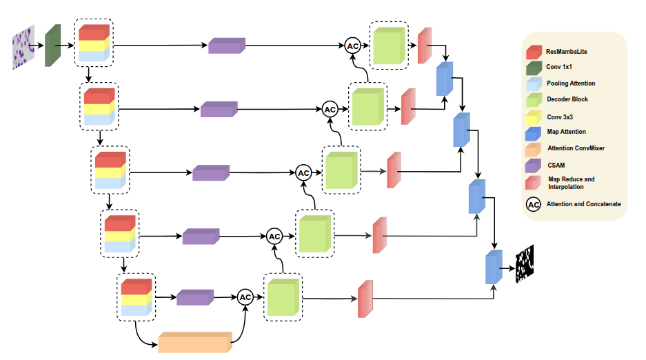
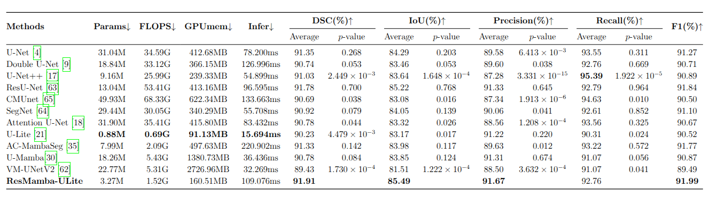
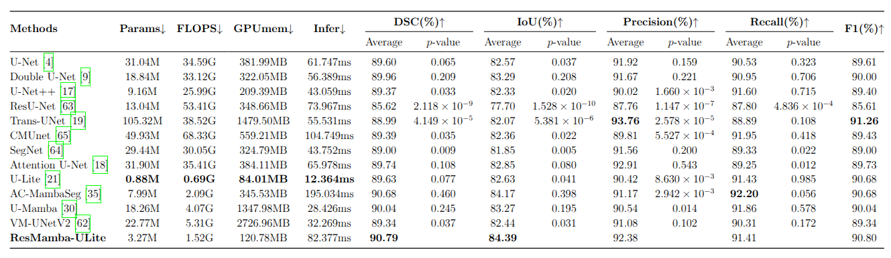
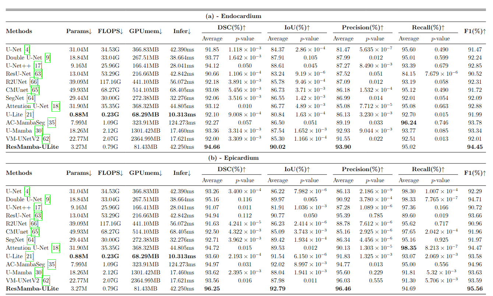

# [ResMamba-ULite: A lightweight model for medical image segmentation with residual visual state space and multiple attention](https://link.springer.com/article/10.1007/s11042-025-21101-9)

##  Abstract
The field of biomedical image segmentation has been a highly critical topic in deep learning-based research in recent times. Since the rise of deep learning algorithms for image processing over the last decade, numerous neural network models have been introduced, promising a more efficient and less labor-intensive approach to precise medical image segmentation. This advancement has already had, and will continue to have, a substantial impact on the development of better healthcare systems for both doctors and patients, especially in today’s context. While several cutting-edge models such as convolution-based or Transformer-based architectures, particularly those based on the Mamba framework in recent studies, have proven to be highly effective in biomedical image segmentation, there remains a need for further optimization of both models and loss functions. In response to this need and inspired by Mamba-based models, we propose a novel segmentation model, termed ResMamba-ULite, which also utilizes depth-wise convolution to achieve low computational cost (only 3.27M parameters, 1.52G FLOPs, and GPU memory usage as low as 81.43MB) while delivering fast inference (as low as 42.25 ms per image) and strong performance across multiple datasets. Additionally, we introduce a new loss function called Marginal Dice Loss, which successfully combines the ability to provide better separation of closely adjacent objects and addresses the class imbalance problem. Extensive experiments on public medical datasets demonstrate that our model achieves Dice coefficients of 91.91%, 90.79%, 94.66%, and 96.25% on the 2018 Data Science Bowl, ISIC 2018, and Sunnybrook Cardiac (Endocardium and Epicardium) datasets, respectively. These results surpass recent Mamba-based and other state-of-the-art methods, highlighting the effectiveness of our approach in advancing biomedical image segmentation. The code will be available at https://github.com/ndhieu2oo3/ResMamba-ULite.

## Overview of the ResMamba-ULite network architecture

### Table 1: Quantitative Results on DSB 2018

### Table 1: Quantitative Results on ISIC 2018

### Table 2: Quantitative Results on Sunnybrook

